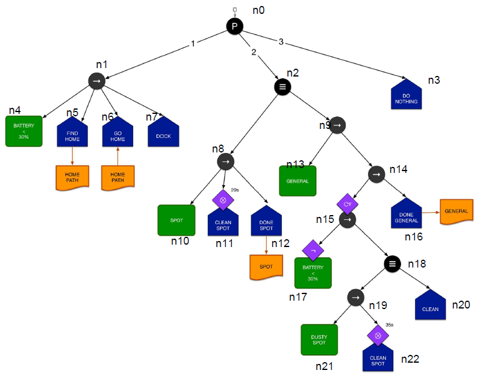

AI HW1 README
------------

### Dependencies

python version 3.6.9
required package: time, numpy

### How to Run

```
$ python3 test.py
```

### Expected Outputs

```
...

==== RUNNING ITERATIONS 22 ====
 |-- n0: composite <Priority>
     |-- n1: composite <Sequence>
         |-- n4: [condition]
             BATTERY < 30 ? 30 --> FAIL
     |-- n1 Sequence --> FAIL
     |-- n2: composite <Selection>
         |-- n9: composite <Sequence>
             |-- n14: composite <Sequence>
                 |-- n15: composite <Sequence> UntilFail
                     |-- n18: composite <Selection>
                         |-- n19: composite <Sequence>
                             |-- n22: [task]  Timer
                                 [clean spot!]--TIME ELAPSED = 2 s --> RUNNING
                         |-- n19 Sequence --> RUNNING
                     |-- n18 Selection --> RUNNING
                 |-- n15 Sequence --> RUNNING
             |-- n14 Sequence --> RUNNING
         |-- n9 Sequence --> RUNNING
     |-- n2 Selection --> RUNNING
 |-- n0 Priority --> RUNNING

...

```
### Name of the nodes



### File list

* `BehaviorTree.py`: instances of node(types, decorators)
* `Node.py`: defined the class node and different types of composite functions and decorator functions 
* `Board.py`: Black Board, contains a dict of public variables named `BOARD` 
* `ConditionFunctions.py`: functions for condition nodes
* `TaskFunctions.py`: functions for tast nodes
* `Type.py`: defined the return values of node object, Types of node, types of Composite, types of Decorators
* `test.py`: test

### Function of each type of node

#### Composite

##### Selection

Children of the Selection node are evaluated in order(from left to right), it returns Returns.SUCCESS as soon as one of the children succeed, otherwise it returns Returns.FAIL.If one of the children is RUNNING, the evaluation will start from the child node with index node.RunningChildId to the last child. 

##### Priority

The priority node is like the selection node, but the children are evaluated 
in the order of priority regardless of the RUNNING states;

##### Sequence

Children of the sequence node are evaluated in order(from left to right), it returns Returns.FAIL as soon as one of the children fails, otherwise it returns Returns.SUCCESS. 
If one of the children is RUNNING, the evaluation will start from the child node with index node.RunningChildId to the last child. 

#### Decorator

Decorator function will be executed after the main node function. It changes the return value of the node accordingly

##### Negation

It changes SUCCESS to FAIL and FAIL to SUCCESS, ignores the RUNNING

##### Until Fail

Returns RUNNING if the node under the decorator returns RUNNING or FAIL; returns SUCCESS of the node returns SUCCESS

##### Until Fail

Returns RUNNING if the node under the decorator returns RUNNING or SUCCESS; returns SUCCESS of the node returns FAIL

##### Timer

Timer decorator will check the BOARD variable `BOARD[TIME]`. If the value of it did not exceeds the set point, timer will return RUNNING, otherwise return the status of the node under timer.

#### Condition Function

Functions related to condition nodes are defined in `ConditionFunctions.py`. 
`xxx_check` functions will return `Results.SUCCESS` if the condition is satisfied, otherwise return `Results.FAIL` 


#### Task Functions

Functions related to tasks are defined in `TaskFunctions.py`. 

##### Test Task

Function `test_task` returns `Results.SUCCESS`, `Results.FAIL`, or `Results.RUNNING` depending on a random number.

##### DO NOTHING

Function `do_nothing` returns `Results.SUCCESS` every time

##### FIND HOME 

Function `find_home` returns `Results.SUCCESS` every time, and update the `BOARD[HOME_PATH]` by a specific string

##### GO HOME 

Function `go_home` returns `Results.SUCCESS` if  `BOARD[HOME_PATH]` is not None, else returns `Results.FAIL`.

##### DOCK

Function `dock` returns `Results.SUCCESS` every time

##### CLEAN SPOT

Function `clean_spot` returns `Results.SUCCESS` every time

##### DONE SPOT

Function `done_spot` resets the board variable `BOARD[SPOT]` to false and returns `Results.SUCCESS` every time

##### DONE GENERAL

Function `done_general` resets the board variable `BOARD[GENERAL]` to false and returns `Results.SUCCESS` every time

##### CLEAN 

To be noticed, Function `clean` returns `Results.FAIL` every time


