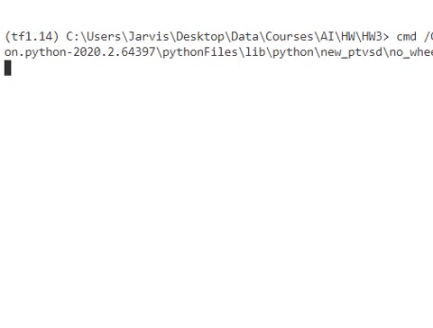
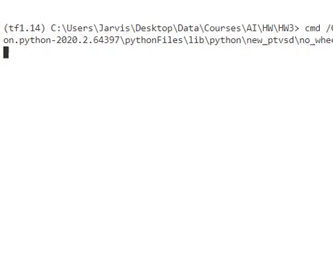
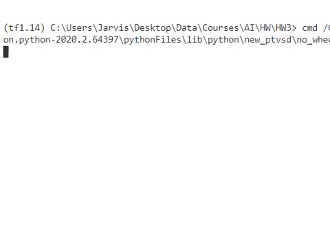

AI HW3 README
------------
Shang Wang; Yang He

### Dependencies

OS: Window 10
python version 3.6.9
required package: `time`, `random`, ``
optional: `curses/windows-curses` for animation like this:




### How to Run

```
$ python3 test.py
```

The default settings enabled the animation. Therefore, the code will automatically execute `pip3 install windows-curses` on Windows if it failed to import  `curses`. 

To disable the animation, simply set the `SETTINGS[ANIME] = False ` in `test.py`. 

### Expected Outputs

The results:

```

Chronological backtracking Search Algorithm
[#i]: immutable cells,
[ _]: unassigned cells
-------------------------------------      
| 1 #7  6 |  | 3 #4 #2 |  | 9  8  5 |      
| 4  2  5 |  | 9  7 #8 |  |#6 #1  3 |      
|#3 #9  8 |  | 5  6  1 |  | 4  2 #7 |      
-------------------------------------      
| 2  6  1 |  | 7  8 #4 |  | 5  3 #9 |      
| 9  8 #3 |  | 2  5  6 |  |#7  4  1 |      
|#5  4  7 |  |#1  9  3 |  | 2  6  8 |      
-------------------------------------      
|#8  1  9 |  | 4  2  5 |  | 3 #7 #6 |      
| 6 #5 #4 |  |#8  3  7 |  | 1  9  2 |      
| 7  3  2 |  |#6 #1  9 |  | 8 #5  4 |      
-------------------------------------      

 >> total nodes explored:  8751
 >> time elapsed: 0.192485 (s)

   =============================== 


Varying Order Backtracking Search Algorithm
[#i]: immutable cells,
[ _]: unassigned cells
-------------------------------------
| 1 #7  6 |  | 3 #4 #2 |  | 9  8  5 |
| 4  2  5 |  | 9  7 #8 |  |#6 #1  3 |
|#3 #9  8 |  | 5  6  1 |  | 4  2 #7 |
-------------------------------------
| 2  6  1 |  | 7  8 #4 |  | 5  3 #9 |
| 9  8 #3 |  | 2  5  6 |  |#7  4  1 |
|#5  4  7 |  |#1  9  3 |  | 2  6  8 |
-------------------------------------
|#8  1  9 |  | 4  2  5 |  | 3 #7 #6 |
| 6 #5 #4 |  |#8  3  7 |  | 1  9  2 |
| 7  3  2 |  |#6 #1  9 |  | 8 #5  4 |
-------------------------------------

 >> total nodes explored:  257
 >> time elapsed: 0.075797 (s)

   =============================== 


Conflict-Directed Backjumping Search Algorithm
[#i]: immutable cells,
[ _]: unassigned cells
-------------------------------------
| 1 #7  6 |  | 3 #4 #2 |  | 9  8  5 |
| 4  2  5 |  | 9  7 #8 |  |#6 #1  3 |
|#3 #9  8 |  | 5  6  1 |  | 4  2 #7 |
-------------------------------------
| 2  6  1 |  | 7  8 #4 |  | 5  3 #9 |
| 9  8 #3 |  | 2  5  6 |  |#7  4  1 |
|#5  4  7 |  |#1  9  3 |  | 2  6  8 |
-------------------------------------
|#8  1  9 |  | 4  2  5 |  | 3 #7 #6 |
| 6 #5 #4 |  |#8  3  7 |  | 1  9  2 |
| 7  3  2 |  |#6 #1  9 |  | 8 #5  4 |
-------------------------------------

 >> total nodes explored:  189
 >> time elapsed: 0.075882 (s)

  =============================== 

```

And the animation for the three different searching algorithm look like:






### File list

* `csp.py`: contains the definition of the classes for the Constraint-Satisfaction problem, namely, the Sudoku puzzle. 
* `chronological_backtracking_search.py`: the implementation of the chronological backtracking search algorithm using pre-established variable ordering. 
* `varying_order_backtracking_search.py`: the implementation of the chronological backtracking search with the Minimum Remaining value(MRV) heuristic in the variable ordering to improve the performance.
* `conflict_directed_backjumping_search.py`: the implementation of the conflict-directed backjumping search algorithm, which takes the advantage of the Minimum Remaining value(MRV) heuristic as variable ordering. 
* `Settings.py`: contains a dictionary of public variables named `SETTINGS`, and types cost/heuristic functions
* `test.py`: test file, the user could overwrite the config in `SETTINGS` to test the performance of three algorithms in this imp


### Keycode explanation

#### Cell 

A cell object is an instance of the fundamental element in the puzzle grid. A cell can either be `immutable`, which is given prior to the value assigning, or not immutable, meaning it is a variable. A variable has an `index` to find itself in the puzzle grid, a `constainted_index_set` to record other cells that might be affected by the value of this particular variable. 
The `possible_assignment` of a variable is the domain of the variable before the value assigned, and it won't change over time. The node expansion in the search tree will reply to it. On the contrary, the `avail_assignment` varies according to the content of the `conflict_set`. It could be useful for guiding the backjumping and selecting the order of the variables and their values.  

#### Puzzle Grid 
A puzzle grid object presents the main board of the Suduko puzzle.  The ` __init_board_states` according to `SETTINGS` initializes the puzzle grid. The ` __init_possible_assignment`  excludes values which occupied by immutable cells at the beginning.  The `update_conflict_set`  updates conflict_sets of all of the mutable variables in the grid. It can display the searching process and result by using anime.

####  Chronological_backtracking_search
It is a uniformed searching based on a depth-first search algorithm.
`recursive_backtracking`  recursively backtracks the search tree. The step is the current step in the order.

#### Conflict Directed Backjumping Search 
The `select_unassigned_variable` selects an unassigned variable from all the unassigned variables guided by MRV heuristic.
The `conflict_directed_backjump`recursively searches for a variable with available assignments in the conflict set and returns to the step in the current assigned variable list `assigned var`. The `merge_conflict_set` merges the two conflict set and sorted with the order of current `assigned var`.


### Notes about the performance
Chronological backtracking Search explored 8751 nodes and cost 0.192485 s. 
Varying Order Backtracking Search explored 257 nodes and cost 0.075797 s.  
Conflict-Directed Backjumping Search explored  189 nodes and cost 0.075882 s.
It shows that the CDB search has higher performance and can reduce the number of explored nodes and searching time.
